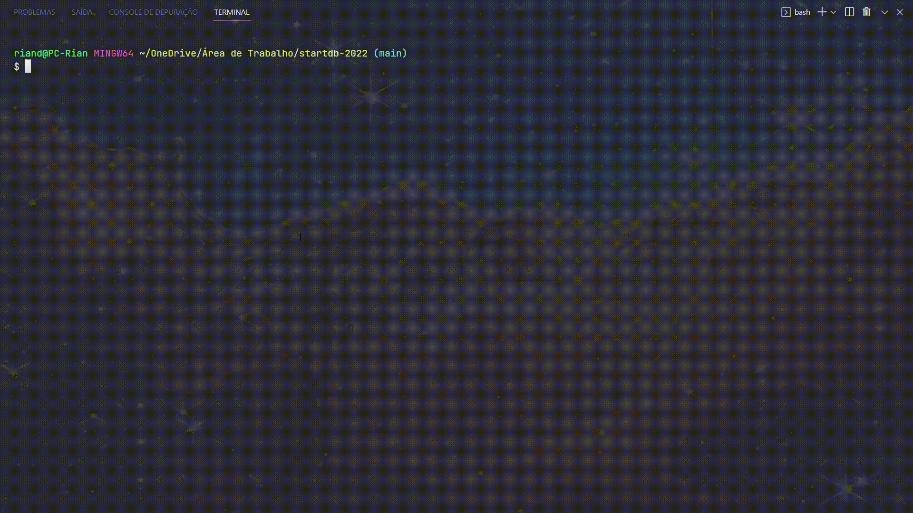

  

  <h1>🚀 Desafio - StartDB 2022 🚀</h1>

## 📚 Sobre

Jogo da forca desenvolvido durante a seleção do [StartDB 2022](https://start.db.tec.br/#etapas) da [DBServer](https://db.tec.br/). O repositório do desafio proposto se encontra [aqui](https://github.com/dbserver/startdb-2022).

## 📝 Notas

Para melhor experiência, utilize o terminal em tela cheia.

## 🔎 Demonstração

  

## 🛠️ Tecnologias utilizadas

 

<table align="center">
  <tbody>
    <tr>
      <td align="center" height="110" width="140">
        
         
        JavaScript
      </td>
      <td align="center" height="110" width="140">
        
         
        Node.js
      </td>
    </tr>
  </tbody>
</table>

 

✨ Made with 💙 by <a href="https://github.com/riandeoliveira"><strong>Rian Oliveira</strong></a> ✨

